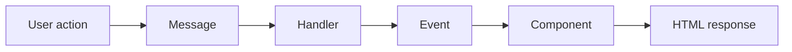

# Lucid

Lucid is a Ruby framework for building reactive, hypermedia applications with a
message-driven architecture.

Instead of centering your UI around routes and controllers, Lucid organizes
interactive behavior around three primitives:

- `Messages` describe user intent.
- `Handlers` apply business effects and publish events.
- `Components` render application state to HTML.

The result is a UI layer that is easier to refactor, easier to compose, and
more naturally aligned with server-rendered hypermedia than a route-centric
controller stack.

## At A Glance

- Model user intent as `Messages`, not route helpers.
- Keep business effects in `Handlers`, not view code.
- Render server-side UI with stateful `Components`.
- Update the browser with normal HTML and HTMX-friendly partial responses.



## Quickstart

Run the included example app from this repository:

```bash
bundle install
bundle exec ruby examples/hello_world/app.rb
```

Then open `http://localhost:4567`.

The example defines:

- a `Link` message for navigation intent
- a root `Component` that reacts to that message
- a `Lucid::App` subclass that serves the component tree

If you want to inspect it first, see
[examples/hello_world/app.rb](examples/hello_world/app.rb).

## What Lucid Is

Lucid is a specialized framework for interactive HTML applications in Ruby. It
fits best when you want:

- server-rendered UI with rich interactions
- hypermedia-style navigation and updates
- a clean separation between UI intent, business logic, and rendering
- URLs derived from application state rather than hand-authored route strings

Lucid is not a full-stack application framework. It does not try to own your
data layer, ORM, or every integration concern in your app.

## Core Model

### Messages

Messages are value objects that describe what the user wants to do.

- `Link` messages represent navigation or state changes via `GET`
- `Command` messages represent mutations via `POST`
- `Event` messages represent things that happened in the system

This shifts your application model from "which URL should this hit?" to "what
intent is being expressed?"

### Handlers

Handlers respond to messages and coordinate effects such as:

- loading domain objects
- enforcing policies
- writing data
- publishing follow-up events
- triggering response effects such as redirects

Handlers keep business logic out of rendering code while still participating in
the same message flow.

### Components

Components are Ruby objects that render HTML and react to state and events.

They can:

- declare typed state and props
- compose nested subcomponents
- respond directly to `Link` messages
- re-render when relevant events occur

Components are the rendering layer, not a place to bury controller logic.

## How It Fits Together

A typical mutation flow looks like this:

1. A user action submits a `Command`.
2. A `Handler` receives that command and applies business logic.
3. The handler publishes one or more `Event`s.
4. Interested `Component`s respond by updating state or re-rendering.
5. The client receives HTML representing the changed UI.

Navigation is simpler:

1. A user follows a `Link`.
2. A `Component` handles the link message directly.
3. Component state changes.
4. Lucid renders the new UI state and URL.

## A Small Example

Lucid code reads in terms of intent rather than route names.

```ruby
class ShowEditForm < Lucid::Link
  param :post_id, Integer
end

class DeletePost < Lucid::Command
  param :post_id, Integer
end

class PostView < Lucid::Component::Base
  param :post_id, Types.integer
  param :editing, Types.bool.default(false)

  to ShowEditForm do |msg|
    update(editing: true, post_id: msg.post_id)
  end
end

class DeletePostHandler < Lucid::Handler
  perform DeletePost do |cmd|
    post = Post.find(cmd.post_id)
    post.destroy!
    publish PostDeleted.new(post_id: cmd.post_id)
  end
end
```

The important part is the shape of the system:

- the link expresses intent
- the component handles navigation state
- the command expresses a mutation
- the handler owns the side effect

That separation is the main payoff of Lucid.

## Project Status

Lucid is an actively evolving framework with a stable conceptual core and a
small, focused documentation set. The API surface is opinionated and still
being refined.

## Why This Approach

Lucid is designed to avoid common coupling problems in traditional MVC-style
web applications:

- views do not need to know concrete route strings
- business logic does not need to live in controller actions
- navigation state can be represented in URLs instead of hidden session state
- components can react to events without manual refresh plumbing

This is especially useful for applications with rich, stateful interfaces where
server-rendered HTML is still the right delivery model.

## Installation

Add the gem to your application:

```ruby
gem "lucid"
```

Then install dependencies:

```bash
bundle install
```

Lucid depends on:

- `rack`
- `sinatra`
- `zeitwerk`
- `dry-types`, `dry-struct`, and `dry-schema`
- `papercraft`

## Project Structure

Lucid includes conventions for organizing code into core code and features.

At a high level:

- `core/` holds shared application code
- `features/` holds feature-specific code and feature entrypoints
- feature directories can include views, services, models, and related code

The internal loader supports a feature-oriented structure instead of requiring
everything to funnel through controllers.

## Documentation Map

The documentation set is intentionally small:

- [Docs Index](docs/index.md)
- [Why Lucid?](docs/why.md)
- [Hello World](docs/hello.md)
- [Architecture](docs/architecture.md)
- [Messages](docs/messages.md)
- [Components](docs/components.md)
- [Handlers](docs/handlers.md)
- [Reference: State](docs/reference/state.md)
- [Reference: Templates](docs/reference/templates.md)

If you are new to the framework, start with `why`, `hello`, and `architecture`.
